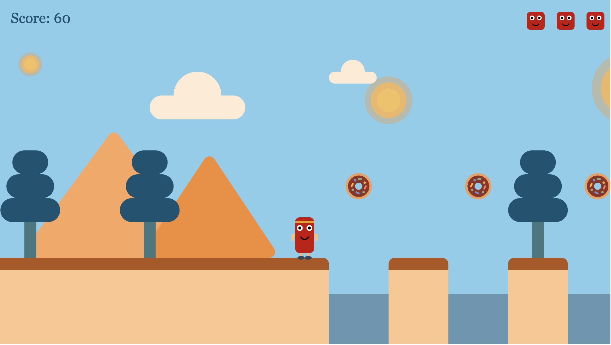

# 🍩 SweetSprint

[🔗 Live Demo](https://sweet-sprint.netlify.app)

## 🕹️ About the Game

**SweetSprint** is a 2D runner platformer game built with p5.js. You control a character using the keyboard arrow keys to move left and right, and you can jump by pressing the Up arrow or Space key. Dodge obstacles and run as far as you can!

## 🚀 Features

- 🎨 Developed from scratch using **p5.js**
- ⌨️ Keyboard controls:
  - **Left (←)** and **Right (→)** arrows to move the character
  - **Up arrow (↑)** or **Space bar** to jump
- 🎧 Sound effects included
- 🌐 Web-based — no installation required

## 📸 Screenshots



## 🧠 How to Play

1. Use the **Left (←)** and **Right (→)** arrow keys to move your character.
2. Press the **Up arrow (↑)** or **Space bar** to jump over obstacles.
3. Avoid hitting any obstacles or falling off platforms.
4. Your score increases based on how many donuts you collect.

## 📂 Running Locally

To run the project locally, follow these steps:

```bash
git clone https://github.com/xhokcu/sweet_sprint_game.git
cd sweet_sprint_game
open index.html
```
